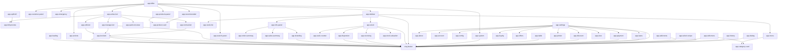

# Component hierarchy

```mermaid
graph TD;
    app-loading-->viraj-button
    app-biller-->app-actions
    app-actions-->viraj-button
    app-biller-->app-active-kot
    app-active-kot-->app-bill-preview
    app-active-kot-->app-edit-kot
    app-edit-kot-->app-kot-item
    app-kot-item-->viraj-button
    app-active-kot-->app-manage-kot
    app-manage-kot-->app-kot-item
    app-kot-item-->viraj-button
    app-manage-kot-->viraj-button
    app-active-kot-->app-normal-kot
    app-normal-kot-->app-kot-item
    app-kot-item-->viraj-button
    app-active-kot-->app-quick-kot-view
    app-biller-->app-customer-panel
    app-biller-->app-emergency
    app-biller-->app-products-panel
    app-products-panel-->app-product-card
    app-biller-->app-recommended
    app-recommended-->app-product-card
    app-biller-->app-search-panel
    app-search-panel-->viraj-button
    app-biller-->app-sidebar
    app-sidebar-->app-info-panel
    app-info-panel-->app-branding
    app-branding-->viraj-button
    app-info-panel-->app-order-summary
    app-info-panel-->app-sales-summary
    app-sidebar-->app-menu
    app-menu-->app-category-card
    app-sidebar-->app-stock-list
    app-sidebar-->app-stock
    app-stock-->app-cash-counter
    app-stock-->app-dispersion
    app-dispersion-->viraj-button
    app-stock-->app-receiving
    app-receiving-->viraj-button
    app-stock-->app-stock-valuation
    app-stock-->viraj-button
    app-sidebar-->viraj-button
    app-biller-->app-system
    app-system-->viraj-button
    app-split-bill-->app-bill-preview
    app-table-->viraj-button
    app-settings-->app-about
    app-settings-->app-account
    app-settings-->app-config
    app-settings-->app-discount
    app-discount-->viraj-button
    app-settings-->app-loyalty
    app-settings-->app-offers
    app-settings-->app-payment
    app-payment-->viraj-button
    app-settings-->app-printer
    app-settings-->app-taxes
    app-taxes-->viraj-button
    app-settings-->app-view
    app-settings-->viraj-button
    app-edit-menu-->app-category-card
    app-edit-menu-->viraj-button
    app-add-menu-->viraj-button
    app-select-recipe-->viraj-button
    app-history-->viraj-button
    app-dialog-->viraj-button
```
